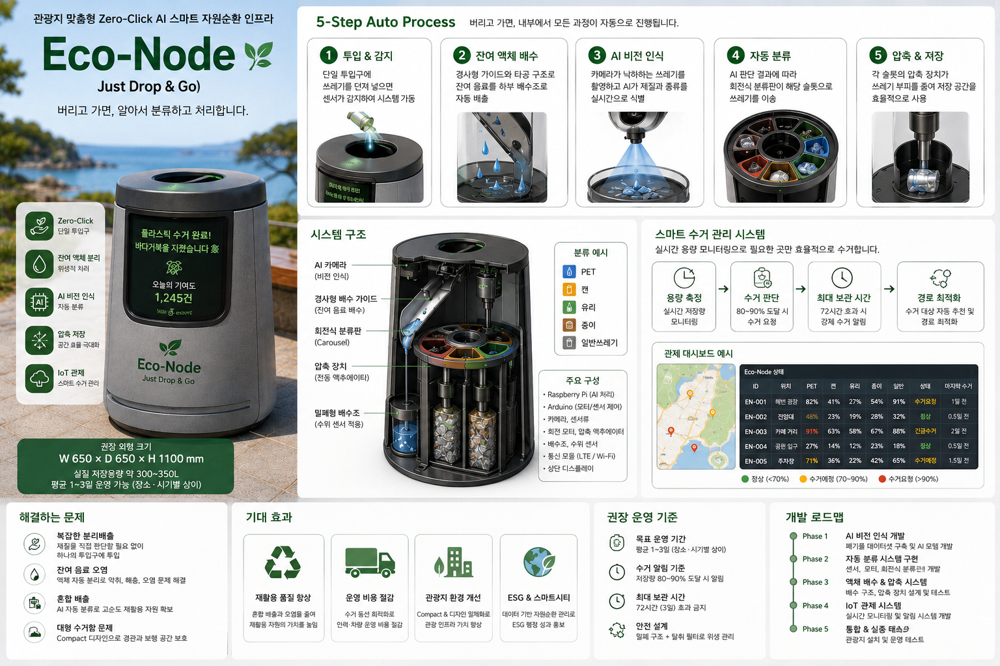

# 🌱 Eco-Node: 관광지 맞춤형 Zero-Click AI 스마트 자원순환 인프라

> **"Just Drop & Go — 버리고 가면, 알아서 분류하고 처리합니다."**
> 관광객의 분리배출 부담을 없애고, **[인식 ➔ 처리 ➔ 분류 ➔ 압축 ➔ 수거 모니터링]**으로 이어지는 폐기물 처리 전체 라이프사이클을 자동화하는 스마트 자원순환 인프라입니다.

---

## 💡 프로젝트 개요 (Project Overview)

**Eco-Node**는 관광객이 쓰레기의 종류나 재질을 직접 판단할 필요 없이 단일 투입구에 버리기만 하면, AI 비전과 스마트 메커니즘을 통해 **자동 인식 · 잔여 액체 처리 · 자동 분류 · 단일 압축 · 실시간 수거 관제**를 통합 수행하는 Edge AI 기반 스마트시티 폐기물 관리 시스템입니다.

* **Target Experience:** 아무것도 하지 않는 **Zero-Click UX**
* **Core Philosophy:** 버리는 행동은 그대로 두고, 분리배출과 수거의 복잡함은 기술이 가져간다.

---

## 🎯 해결하려는 문제 (Problem Statement)

1. **복잡한 분리배출 및 오투입:** 관광객이 PET, 캔, 종이 등 재질을 직접 판단하여 버려야 하는 불편함 및 혼합 배출 문제.
2. **잔여 음료 오염:** 재활용품에 남은 음료가 섞여 악취, 초파리 등 해충 발생 및 자원 재활용 순도(품질) 저하.
3. **도시 경관 및 공간 침해:** 무분별하게 설치된 대형 쓰레기통으로 인한 관광지 경관 훼손 및 보행 공간 축소.
4. **비효율적인 수거 순찰:** 적재량을 알 수 없어 모든 쓰레기통을 직접 방문·확인해야 하는 인력 및 운용 비용 낭비.

---

## ⚙️ 6-Step Auto Process

카메라 렌즈 오염을 방지하고 정확한 비전 인식을 보장하기 위해 **"AI 비전 인식 ➔ 액체 처리"** 순으로 프로세스를 최적화하였습니다.

### 🔄 전체 시스템 메커니즘 흐름

```
       [ 쓰레기 투입 ]
            │
      ① 투입 감지 (센서)
            │
      ② 🔍 AI Vision (카메라) ─── 폐기물 재질/종류 판단
            │
    ┌───────┴───────┐
    ▼               ▼
[재활용 가능]    [일반/예외]
    │               │
③ 액체 처리     일반쓰레기
    │               │
    └───────┬───────┘
            │
      ④ Carousel 이동 (단일 압축 위치)
            │
      ⑤ 🔨 Single Press Module (압축 & 저장)
            │
      ⑥ 📡 용량 / 보관시간 모니터링
            │
  ┌─────────┴─────────┐
  ▼                   ▼
[80~90% 충전]     [72시간 초과]
  │                   │
  └─────────┬─────────┘
            │
    [ 스마트 관제 수거 알림 ]

```

### 📌 각 단계별 세부 수행 내용

1. **투입 감지 (Single Input):** 사용자는 구분 없이 하나의 투입구에 배출.
2. **AI Vision 인식:** 청결 구역 상단 카메라를 통해 투입된 폐기물의 종류 및 재질 1차 판단.
3. **잔여 액체 처리:** 경사형 가이드 및 밀폐 배수조를 통해 남은 음료를 분리 및 수거 (AI 오염 방지).
4. **Carousel 회전:** 판단된 재질 카테고리에 맞춰 내부 Carousel이 공유 압축 위치로 회전.
5. **Single Press 압축:** 단일 압축 모듈(Single Actuator)을 공유하여 부피를 압축한 뒤 해당 저장 공간으로 이송.
6. **Smart Monitoring:** 적재량 및 보관시간(최대 72시간)을 실시간 측정하여 IoT 관제 시스템으로 전송.

---

## 🧠 시스템 Architecture & Hardware

| 구성 요소 | 기술 스펙 / 역할 | 비고 |
| --- | --- | --- |
| **Main Compute (Prototype)** | Raspberry Pi (Edge AI 추론 및 센서 제어) | Commercialization 단계 시 Jetson Orin Nano / Coral TPU 검토 |
| **Sub Compute** | Arduino (모터, Carousel, 압축 액추에이터 제어) | MCU 제어 담당 |
| **Vision Sensor** | High-resolution Camera Module | 상부 오염 방지 하우징 적용 |
| **Sorting & Press** | Carousel 회전 메커니즘 + **Single Press Module** | 원가 절감 및 구조 단순화 (1개 압축기 공유) |
| **Hygiene System** | 밀폐형 탈착식 배수조 + 탈취 모듈 기본 탑재 | UVC 살균 모듈은 시제품 실증 후 선택 적용 |
| **Power Supply** | **AC 220V 상용 전원 기본 사용** | 태양광 + 배터리는 확장 옵션으로 검토 |

---

## 📦 목표 사양 (Target Specifications)

> *※ 아래 수치는 시제품 개발을 위한 **설계 목표값**이며, 현장 실증 데이터에 따라 검증 및 조정됩니다.*

* **외형 크기:** 약 W 650 × D 650 × H 1100 mm (Compact Street Furniture)
* **실질 저장 용량:** 약 300 ~ 350L (압축 효율 감안)
* **최대 보관 시간:** 72시간 (3일 이내 강제 수거 기준)
* **수거 알림 기준:** 적재율 80 ~ 90% 달성 시

---

## 🚛 Smart Collection & IoT 관제 System

Eco-Node는 무작위 순찰형 수거 방식에서 벗어나 **데이터 기반의 동선 최적화 수거**를 지향합니다.

### 수거 운영 스테이터스

* 🟢 **0 ~ 70% (정상):** 모니터링 유지
* 🟡 **70 ~ 90% (수거 예정):** 수거 경로 예측 대상 등록
* 🔴 **90% 이상 또는 72시간 초과 (우선 수거):** 즉시 수거 알람 발송

### 📡 관제 모니터링 및 수거 최적화 메커니즘

```
Eco-Node #001 [82%] 🟡  |  Eco-Node #002 [43%] 🟢  |  Eco-Node #003 [94%] 🔴 (우선수거)
                          ⬇
            [ IoT 관제센터 : 최적 수거 경로 생성 ]
                          ⬇
               [ 미화/수거 차량 효율적 출동 ]

```

---

## 📊 Target KPIs (목표 성과 지표)

* **AI 폐기물 분류 정확도:** **90% 이상** (단일 이미지 비전 모델 기준)
* **수거 동선 및 인력 절감:** 기존 순찰 방식 대비 **30 ~ 40% 절감** 목표
* **저장 공간 효율:** 압축 메커니즘 적용을 통해 기존 일반 수거함 대비 **3배 이상** 적재
* **최대 보관 제한:** 악취 및 위생 문제 방지를 위해 **72시간 내 수거 관리**

> *※ 목표 수치는 프로토타입 테스트 및 실제 관광지 현장 실증을 통해 검증 및 조정될 예정입니다.*

---

## 🛠️ 개발 로드맵 (Development Roadmap)

1. **Phase 1 — AI Vision & Dataset (Prototype):** 폐기물 이미지 데이터 수집 및 Raspberry Pi 기반 AI 분류 모델 구현
2. **Phase 2 — Sorting & Mechanism:** 센서 + Arduino 연동 Carousel 회전 및 Single Press 압축 모듈 메커니즘 구현
3. **Phase 3 — Drain & Hygiene Validation:** 잔여 액체 분리 배수조, 탈착 세척 구조 및 밀폐/탈취 시스템 실증
4. **Phase 4 — Smart IoT Dashboard:** 적재량/시간 센싱 데이터 송수신 및 관제 웹 UI 구축
5. **Phase 5 — System Integration & Commercialization:** 통합 프로토타입 제작, 현장 테스트 및 고성능 Edge AI (Jetson 등) 확장 검토

---

## 🏷️ Keywords

`AI Computer Vision` `Edge AI` `Smart City` `Recycling` `Waste Sorting` `Resource Circulation` `Raspberry Pi` `Arduino` `IoT Automation` `ESG` `Smart Tourism`
